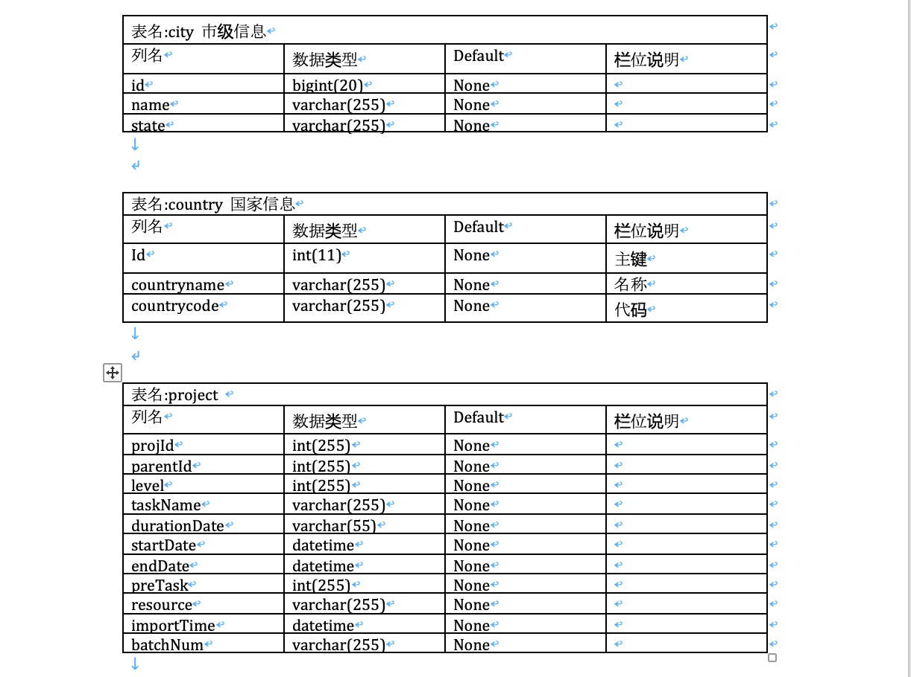

## export data table structure to office document

   every project i need to export data table structure to office document,
   and this takes time , so i wrote this code to help me.
   
## requirements

   * python3.6+
   * currently only support mysql
 
## Quick Start
    
  * install:
    
  ```
    pip install requirements.txt
  ```
  * setting database connection:
  ```
    # database connection config
    DB_CONFIG = {
        'host': '127.0.0.1',  # host name
        'port': 3306,  # port number
        'user': 'root',  # user name
        'password': 'root',  # user password
        'db': 'mytest'  # database name
    }
  ```
  * run
  ```
      python src/main.py   
  ```
  * output demo
    
    
## 🙏 thanks

* [PyMySQL](https://github.com/PyMySQL/PyMySQL)：PyMySQL
* [python-docx](https://github.com/python-openxml/python-docx)：python-docx

## License
   MIT © [feizhang](https://github.com/feizhang365) 
